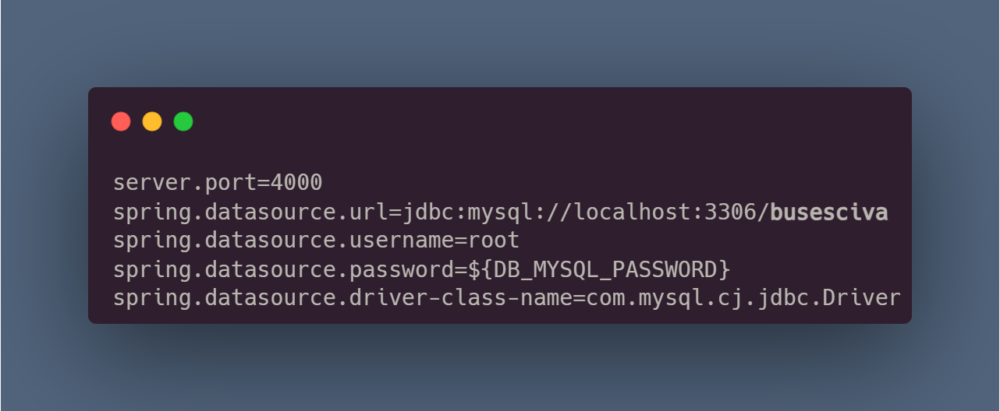

# BACK END prueba tecnica CIVA

## Dependencias
- Spring Data JPA
- MySQL Driver
- Lombok 
- Spring Web
- Spring Security
- Validation 

## Consideraciones antes de usarse
Para poder ser usado se debe aplicar las siguientes configuraciones
</img> 
Como se puede ver en la imagen: 
- se usa el puerto 4000 
- se debe crear una base de datos con el nombre <strong>busesciva</strong>
- la contraseña está colocada con una variable de entorno para que pueda ser creada por cualquiera que use esta api, el nombre de esta es <strong>DB_MYSQL_PASSWORD</strong>

## API funcionando
